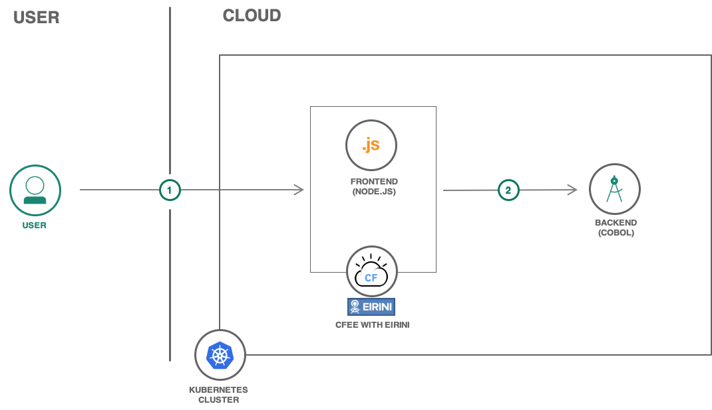

# CFEE Eirini Storefront

This repo consists of a [backend COBOL app](https://github.com/IBM-Cloud/cfee-eirini-storefront/tree/master/backend) and a [frontend Node App](https://github.com/IBM-Cloud/cfee-eirini-storefront/tree/master/frontend). The focus here is to understand how these two apps can be deployed and managed with one Cloud Foundry Enterprise Environment instance.

A frontend Node.js shopping cart app is talking to the backend Cobol app to fetch the shopping cart products.

## Architecture

1. User connects to the app to view the Storefront site. 
2. The Storefront frontend fetch the cart products from backend Cobol service. 

## Deploy the apps

Steps required:

1. Deploy the [backend COBOL app](https://github.com/IBM-Cloud/cfee-eirini-storefront/tree/master/backend).
1. Deploy the [frontend Node.js app](https://github.com/IBM-Cloud/cfee-eirini-storefront/tree/master/frontend).

# Issues

If you have any question or doubt, please [create an issue](https://github.com/IBM-Cloud/cfee-eirini-storefront/issues).

# License

Licensed under the [Apache License, Version 2.0](http://www.apache.org/licenses/LICENSE-2.0).

# Product photos

* Photo by <a href="https://burst.shopify.com/@lunchmoney?utm_campaign=photo_credit&amp;utm_content=Picture+of+Crepes+Filled+With+Fresh+Fruit+%E2%80%94+Free+Stock+Photo&amp;utm_medium=referral&amp;utm_source=credit">Michelle Krozser</a> from <a href="https://burst.shopify.com/api-food-drink?utm_campaign=photo_credit&amp;utm_content=Picture+of+Crepes+Filled+With+Fresh+Fruit+%E2%80%94+Free+Stock+Photo&amp;utm_medium=referral&amp;utm_source=credit">Burst</a>
* Photo by <a href="https://burst.shopify.com/@matthew_henry?utm_campaign=photo_credit&amp;utm_content=High+Res+Vertical+Citrus+Fruit+Pile+Picture+%E2%80%94+Free+Images&amp;utm_medium=referral&amp;utm_source=credit">Matthew Henry</a> from <a href="https://burst.shopify.com/fruit?utm_campaign=photo_credit&amp;utm_content=High+Res+Vertical+Citrus+Fruit+Pile+Picture+%E2%80%94+Free+Images&amp;utm_medium=referral&amp;utm_source=credit">Burst</a>
* Photo by <a href="https://burst.shopify.com/@goodcitizen?utm_campaign=photo_credit&amp;utm_content=Browse+Free+HD+Images+of+Breakfast+Flatlay+With+Fruit+And+Waffles&amp;utm_medium=referral&amp;utm_source=credit">Humphrey Muleba</a> from <a href="https://burst.shopify.com/cooking?utm_campaign=photo_credit&amp;utm_content=Browse+Free+HD+Images+of+Breakfast+Flatlay+With+Fruit+And+Waffles&amp;utm_medium=referral&amp;utm_source=credit">Burst</a>
* Photo by <a href="https://burst.shopify.com/@kculp?utm_campaign=photo_credit&amp;utm_content=Browse+Free+HD+Images+of+Colorful+Fruit+And+Custard+Tart&amp;utm_medium=referral&amp;utm_source=credit">Karen Culp</a> from <a href="https://burst.shopify.com/food?utm_campaign=photo_credit&amp;utm_content=Browse+Free+HD+Images+of+Colorful+Fruit+And+Custard+Tart&amp;utm_medium=referral&amp;utm_source=credit">Burst</a>
* Photo by <a href="https://burst.shopify.com/@sarahpflugphoto?utm_campaign=photo_credit&amp;utm_content=Browse+Free+HD+Images+of+Toast+With+Peanut+Butter+And+Fruit&amp;utm_medium=referral&amp;utm_source=credit">Sarah Pflug</a> from <a href="https://burst.shopify.com/flatlay?utm_campaign=photo_credit&amp;utm_content=Browse+Free+HD+Images+of+Toast+With+Peanut+Butter+And+Fruit&amp;utm_medium=referral&amp;utm_source=credit">Burst</a>
* Photo by <a href="https://burst.shopify.com/@lunchmoney?utm_campaign=photo_credit&amp;utm_content=Free+Stock+Photo+of+Assorted+Pastries+%E2%80%94+HD+Images&amp;utm_medium=referral&amp;utm_source=credit">Michelle Krozser</a> from <a href="https://burst.shopify.com/food?utm_campaign=photo_credit&amp;utm_content=Free+Stock+Photo+of+Assorted+Pastries+%E2%80%94+HD+Images&amp;utm_medium=referral&amp;utm_source=credit">Burst</a>
